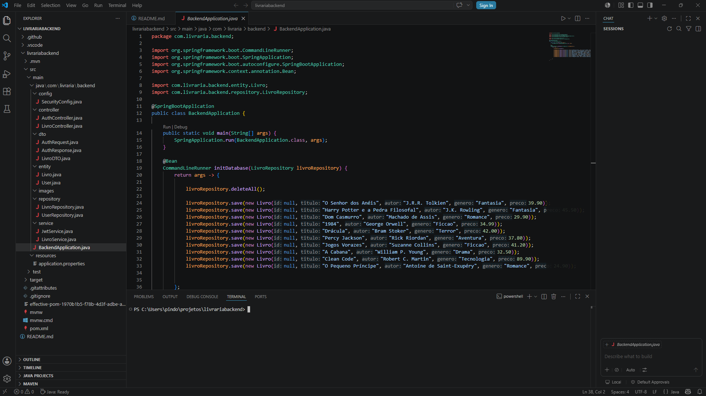

# 📚 Livraria Backend

Backend desenvolvido para o sistema de gerenciamento de livraria utilizando Java + Spring Boot.

---

# 🚀 Tecnologias Utilizadas

* Java 25
* Spring Boot
* Spring Security
* JWT Authentication
* Spring Data JPA
* MySQL
* Maven
* Lombok
* REST API

---

# 📂 Estrutura do Projeto

```bash
src/main/java/com/livraria/backend
│
├── config
├── controller
├── dto
├── entity
├── repository
├── service
```

---

# 🔐 Funcionalidades

* Autenticação com JWT
* Login de usuários
* Segurança com Spring Security
* CRUD de livros
* API REST
* Integração com banco MySQL
* Organização em camadas
* Uso de DTOs
* Persistência com JPA

---

# 🛠 Endpoints Principais

## 📖 Livros

* GET `/livros`
* GET `/livros/{id}`
* POST `/livros`
* PUT `/livros/{id}`
* DELETE `/livros/{id}`

---

## 🔐 Autenticação

* POST `/auth/login`

---

# ⚙️ Como Executar o Projeto

## 1️⃣ Clonar o repositório

```bash
git clone https://github.com/seuusuario/livrariabackend.git
```

---

## 2️⃣ Entrar na pasta

```bash
cd livrariabackend
```

---

## 3️⃣ Configurar o banco MySQL

Edite o arquivo:

```bash
src/main/resources/application.properties
```

Exemplo:

```properties
spring.datasource.url=jdbc:mysql://localhost:3306/livraria
spring.datasource.username=root
spring.datasource.password=sua_senha
```

---

## 4️⃣ Executar o projeto

### Windows

```bash
.\mvnw.cmd spring-boot:run
```

### Linux / MacOS

```bash
./mvnw spring-boot:run
```

---

# 📌 Arquitetura Utilizada

O projeto foi organizado seguindo separação em camadas:

* Controller → gerenciamento das rotas
* Service → regras de negócio
* Repository → acesso ao banco
* DTO → transferência de dados
* Entity → entidades JPA

---

# 🔒 Segurança

O sistema utiliza:

* Spring Security
* JWT Token
* Controle de autenticação
* Proteção de rotas

---

# 🎯 Objetivo do Projeto

Projeto desenvolvido para fins de estudo e prática em desenvolvimento backend com Java e Spring Boot.

---

# 🚧 Melhorias Futuras

* Cadastro de usuários
* Refresh Token
* Swagger/OpenAPI
* Deploy em nuvem
* Docker
* Testes automatizados
* Validações avançadas
* Logs e monitoramento

---

# 👨‍💻 Autor

Projeto desenvolvido para fins de estudo e prática em programação.

---

# 📄 Licença

Este projeto é apenas para fins educacionais.

# VS Code (LivrariaBackend)


